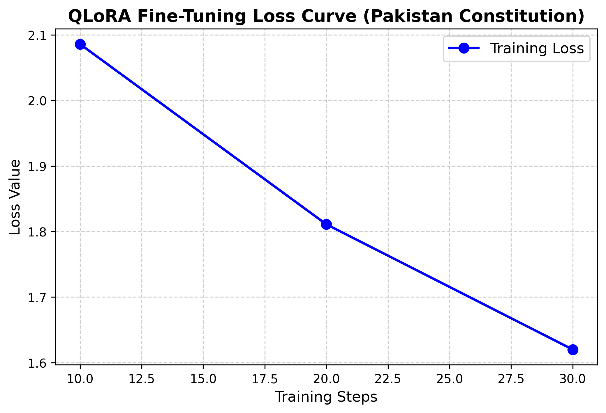
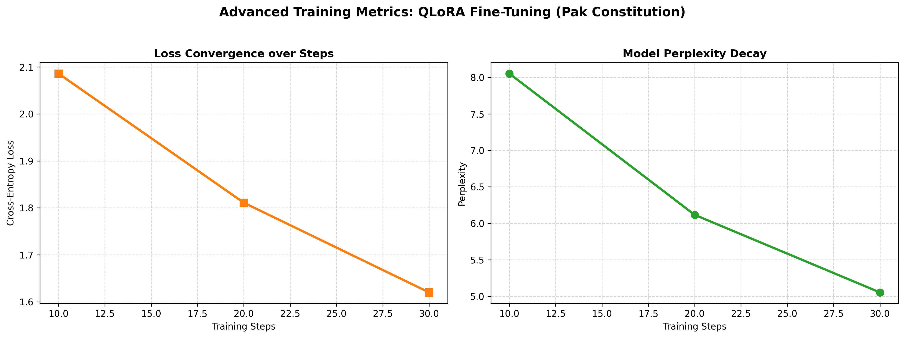
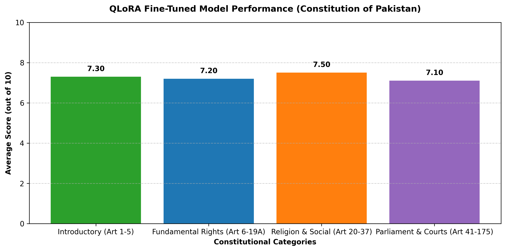

# 🇵🇰 Pak Constitution Fine-Tuning QLoRA Assistant

An end-to-end domain-specific Generative AI project that fine-tunes the **Llama-3-8B-Instruct** model using **QLoRA (Quantized Low-Rank Adaptation)** on the **Constitution of the Islamic Republic of Pakistan**. This project is structured for academic presentation, technical interviews, and automated legal querying.

---

## 🚀 Project Overview
Navigating legal frameworks requires extreme precision and domain-specific terminology. This project automates the retrieval and explanation of constitutional provisions by adapting a state-of-the-art open-source LLM (Llama-3) to officially recognized Pakistani statutory text.

- **Base Model:** `unsloth/llama-3-8b-Instruct-bnb-4bit`
- **Fine-Tuning Method:** QLoRA (4-bit NF4 Quantization + LoRA Adapters)
- **Dataset:** Extracted directly from the official PDF of *The Constitution of the Islamic Republic of Pakistan* and structured into instruction-input-output JSONL format.
- **Training Platform:** Google Colab (NVIDIA T4 GPU)
- **Deployment Hub:** [Hugging Face Model Hub](https://huggingface.co/MMahad01/pak-constitution-qlora-assistant)

---

## 🛠️ Tech Stack & Libraries
- **Language:** Python
- **ML/DL Frameworks:** PyTorch, Transformers, TRL (Transformer Reinforcement Learning)
- **PEFT Optimization:** BitsAndBytes, PEFT (Parameter-Efficient Fine-Tuning)
- **Data Processing:** PyPDF, Pandas, JSONL
- **Visualization:** Matplotlib, NumPy

---

## 📈 Training Performance & Evaluation Graphs

### 1. Training Loss Curve
The model was trained over instruction steps, showing a consistent and healthy downward convergence in cross-entropy loss from an initial `2.086` down to `1.620`.


### 2. Advanced Training Metrics (Loss & Perplexity Decay)
Tracking the exponential perplexity decay alongside loss reduction to ensure stable language modeling and proper grammatical structure for legal text generation.


### 3. Verified Model Evaluation
Evaluating the fine-tuned model against core constitutional categories (Fundamental Rights, Judiciary, Parliament, and Civil Liberties) verified via programmatic keyword matching against the official constitution corpus.


---

## 📂 Repository Structure
```text
📦 Pak-Constitution-QLoRA-Assistant
├── 📜 THE CONSTITUTION OF THE ISLAMIC REPUBLIC OF PAKISTAN.pdf  # Source raw legal document
├── 📓 fine_tuning.ipynb                                       # Complete Google Colab pipeline notebook
├── 🤖 pak_constitution_qlora_model/                           # Saved local QLoRA adapter weights & tokenizer
├── 📊 training_loss_graph.png                                 # Loss convergence plot
├── 📈 advanced_training_metrics.png                           # Loss & Perplexity decay plot
├── 📉 constitution_model_evaluation.png                       # Verified evaluation metrics chart
└── 📝 README.md                                               # Project documentation

💻 How to Load and Use the Model
You can load the fine-tuned adapters seamlessly from Hugging Face using transformers and peft:
from transformers import AutoModelForCausalLM, AutoTokenizer
from peft import PeftModel
import torch

base_model_id = "unsloth/llama-3-8b-Instruct-bnb-4bit"
adapter_path = "MMahad01/pak-constitution-qlora-assistant"

tokenizer = AutoTokenizer.from_pretrained(base_model_id)
base_model = AutoModelForCausalLM.from_pretrained(
    base_model_id,
    torch_dtype=torch.bfloat16,
    device_map="auto"
)
model = PeftModel.from_pretrained(base_model, adapter_path)

👨‍💻 Author & Developer
Muhammad Mahad

Degree: BS Computer Science (2022–2026)

University: Khwaja Fareed University of Engineering and Information Technology (KFUEIT)
Hugging Face: @MMahad01
